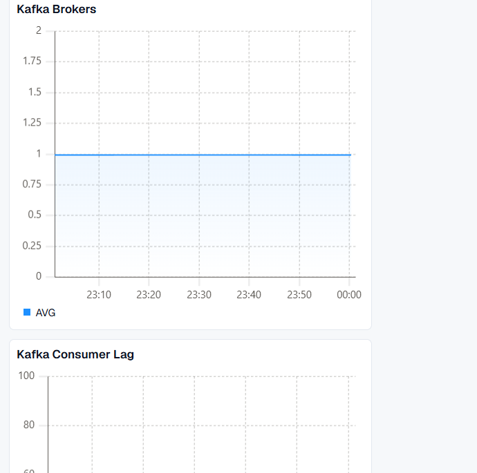
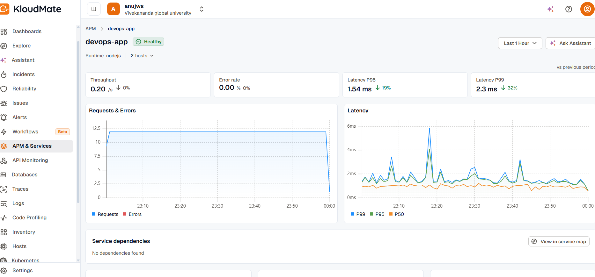
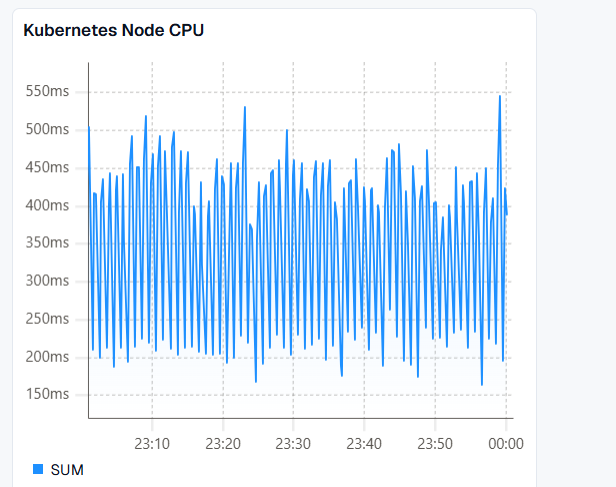
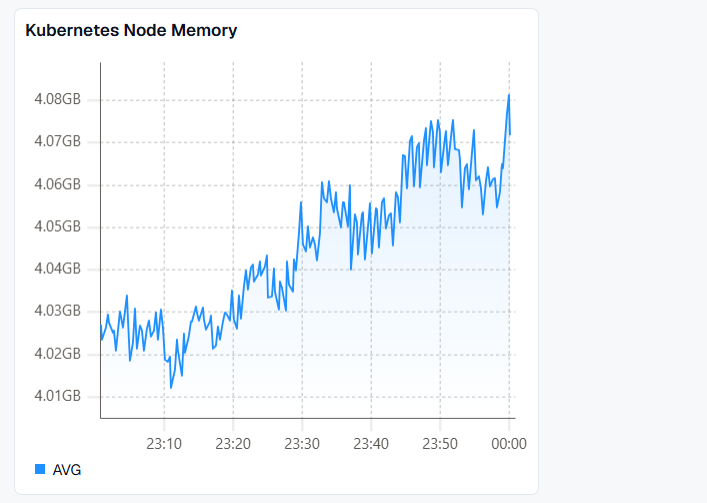
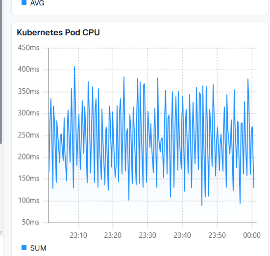
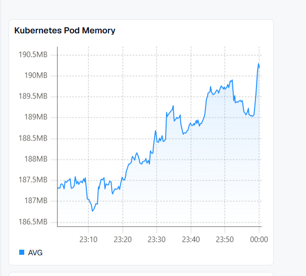

# DevOps Kubernetes Observability Assignment

## Overview

This project demonstrates a Kubernetes-based application deployment with Apache Kafka and OpenTelemetry observability integrated with KloudMate.

## Technologies

- Node.js
- Express.js
- Docker
- Kubernetes
- Minikube
- Apache Kafka
- Strimzi Kafka Operator
- OpenTelemetry Collector
- Prometheus metrics
- KloudMate
- Git / GitHub


## Project Structure

```text
devops-k8s-assignment/
├── app/
│   ├── Dockerfile
│   ├── instrumentation.js
│   ├── package.json
│   ├── package-lock.json
│   └── server.js
│
├── k8s/
│   ├── deployment.yaml
│   ├── service.yaml
│   ├── kafka.yaml
│   ├── kafka-topic.yaml
│   ├── kafka-producer.yaml
│   ├── kafka-consumer.yaml
│   ├── kafka-exporter-service.yaml
│   ├── otel-collector.yaml
│   ├── otel-kubernetes-rbac.yaml
│   └── otel-collector-service.yaml
│
├── .gitignore
└── README.md
``` 

## Application

The Node.js application provides:

- `GET /` - application endpoint
- `GET /health` - health check
- `GET /api/event` - custom application event

The application is containerized using Docker and deployed as two Kubernetes replicas.


## Kafka

Apache Kafka is deployed using the Strimzi Kafka Operator.

The Kafka setup includes:

- Single Kafka broker for the local Minikube environment
- Kafka topic for application events
- Sample producer Job that publishes messages
- Consumer Deployment for consuming messages
- Kafka Exporter for Prometheus-compatible Kafka metrics

The Kafka configuration is defined in `k8s/kafka.yaml` and related manifests.


## OpenTelemetry and KloudMate

OpenTelemetry Collector is used as the central telemetry pipeline for the Kubernetes environment.

The Collector receives and collects:

- Application traces through OTLP HTTP
- Kafka metrics through Prometheus scraping
- Kubernetes node, pod, and container metrics using kubeletstats

The Collector exports telemetry to KloudMate using OTLP/HTTP.

The KloudMate API key is stored securely in a Kubernetes Secret named `kloudmate-credentials` and is not committed to the repository.

### Telemetry Flow

Application / Kubernetes / Kafka
        |
        v
OpenTelemetry Collector
        |
        v
KloudMate
        |
        v
Dashboards and APM


## Setup and Deployment

### 1. Start Minikube

    minikube start --driver=docker

### 2. Verify Kubernetes

    kubectl get nodes
    kubectl get pods -A

### 3. Install Strimzi Kafka Operator

    helm repo add strimzi https://strimzi.io/charts/
    helm repo update
    helm install strimzi-kafka-operator strimzi/strimzi-kafka-operator --namespace kafka --create-namespace

### 4. Deploy the Application

Build the Docker image and load it into Minikube:

    cd app
    docker build -t devops-assignment-app:2.0 .
    minikube image load devops-assignment-app:2.0

Apply the application manifests:

    kubectl apply -f k8s/deployment.yaml
    kubectl apply -f k8s/service.yaml

### 5. Deploy Kafka

    kubectl apply -f k8s/kafka.yaml
    kubectl apply -f k8s/kafka-topic.yaml
    kubectl apply -f k8s/kafka-producer.yaml
    kubectl apply -f k8s/kafka-consumer.yaml
    kubectl apply -f k8s/kafka-exporter-service.yaml

### 6. Deploy OpenTelemetry Collector

Create the KloudMate API key Secret without committing the key to Git:

    kubectl create namespace observability
    kubectl create secret generic kloudmate-credentials -n observability --from-literal=api-key='YOUR_KLOUDMATE_API_KEY'

Apply the Collector configuration and Kubernetes RBAC:

    kubectl apply -f k8s/otel-kubernetes-rbac.yaml
    kubectl apply -f k8s/otel-collector.yaml
    kubectl apply -f k8s/otel-collector-service.yaml

Verify the Collector:

    kubectl get pods -n observability
    kubectl logs deployment/otel-collector -n observability


## KloudMate Dashboard Verification

The KloudMate workspace was used to verify application, Kafka, and Kubernetes infrastructure telemetry collected through OpenTelemetry.

### Application Monitoring

The `devops-app` service was verified in KloudMate APM with:

- Application throughput
- Error rate
- P95 and P99 latency
- Requests and Errors
- Latency trends
- Two application hosts/pods

### Kafka Monitoring

Kafka monitoring was verified using Strimzi Kafka Exporter metrics, including broker and consumer-group information.



### Kubernetes Infrastructure Monitoring

The KloudMate dashboard contains Kubernetes infrastructure metrics collected using the OpenTelemetry Collector.

#### Kubernetes Dashboard



#### Kubernetes Node CPU



#### Kubernetes Node Memory



#### Kubernetes Pod CPU



#### Kubernetes Pod Memory



### Verified Metrics

The following Kubernetes metrics were verified in KloudMate Explore:

- `k8s_pod_cpu_time`
- `k8s_pod_memory_usage`
- `k8s_node_cpu_time`
- `k8s_node_memory_usage`

These metrics demonstrate monitoring of Kubernetes pod and node resource utilization.

### Observability Architecture

The monitoring flow is:

Application / Kafka / Kubernetes
→ OpenTelemetry Collector
→ KloudMate
→ Dashboards and APM

### Assignment Deliverables

The repository contains:

- Kubernetes application manifests
- Dockerfile and application source
- Kafka deployment using Strimzi
- Kafka producer and consumer
- Kafka Exporter configuration
- OpenTelemetry Collector configuration
- Kubernetes RBAC configuration
- Resource requests and limits
- Readiness probe
- KloudMate dashboard screenshots
- Setup and deployment instructions

## Repository

GitHub Repository:

https://github.com/anuj14092003/devops-k8s-assignment
